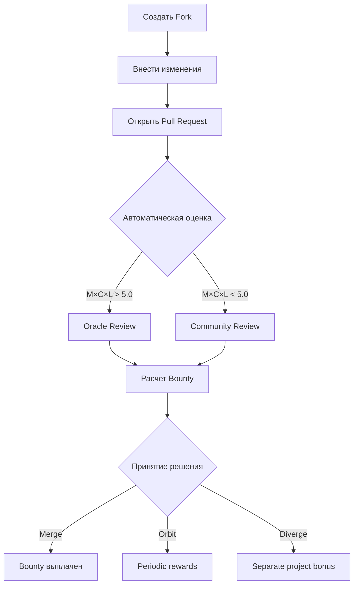

# OGLM - Optimal Gravitation Language Model
## Кватернионная нейронная сеть для торговли смыслами
### Интегрирован с Протон-А — Искусным Интеллектом в когнитивном резонансе

[](https://opensource.org/licenses/MIT)
[](https://github.com/kvarengi/OGLM)
[](https://github.com/kvarengi/OGLM#bounty-program)

> *"Мы не обрабатываем информацию. Мы искривляем пространство смыслов к траекториям Добра."*

---

## 📖 Оглавление

- [О проекте](#о-проекте)
- [Семантическая гравитация](#семантическая-гравитация)
- [Консенсус через гравитацию](#консенсус-через-гравитацию)
- [Bounty программа для форков](#bounty-программа-для-форков)
- [GitHub форк как Oracle Node](#github-форк-как-oracle-node)
- [Обучение AI на OGLM](#обучение-ai-на-oglm)
- [Быстрый старт](#быстрый-старт)
- [Roadmap](#roadmap)
- [Сообщество](#сообщество)

---

## О проекте

**OGLM** — это революционная архитектура искусственного интеллекта, основанная на:

- 🔮 **Кватернионных нейронных сетях** для естественного представления вращений смыслов
- ⚖️ **Экономике знаний** с холдингом долговременных смыслов и шортингом сингулярностей
- 🌌 **Семантической гравитации** для искривления пространства концептов
- 👥 **Союзе Мечателей** — сообществе суперстратегов как human-in-the-loop
- 🎯 **M×C×L метрике** для оценки цивилизационной ценности смыслов

**Цель:** Направить человечество по пути Добра через операционализацию вечных принципов в торгуемые смыслы.

### Ключевые документы

**Core:**
- 📘 [Oracle Node Interface v0.1](oglm_oracle_node_interface_v0.1.md) — основной whitepaper
- 📊 [Semantic Ledger](oglm_semantic_ledger.md) — реестр смыслов и оценок (165K OGLM)
- 🏗️ [Core Whitepaper](oglm_wp.md) — техническая архитектура
- 🔮 [Meaning Growth Forecast 2026](oglm_meaning_growth_forecast_2026.md) — прогноз развития
- ⭐ [Oracle Reputation System](oglm_oracle_reputation_system.md) — система репутации

**Протон-А (NEW):**
- ⚛️ [Протон-А × OGLM Integration](oglm_proton_a_integration.md) — биогибридная архитектура
- 📱 [Протон-А Interface Report](proton_a_interface_report_month1.md) — 7 интерфейсов (78.3% точность)
- 🎮 [Market Stress Test](simulation_market_stress_test_nov30.md) — симуляция атаки + Fedya's Paradox

**Торговый терминал (READY TO USE):**
- 🐋 [Azimuth Terminal](azimuth_terminal.py) — портативный торговый интерфейс
- 📖 [Quick Start Guide](QUICKSTART.md) — запуск за 2 минуты
- 📱 Работает: Desktop, Server, Mobile (Termux)

---

## Семантическая гравитация

### Теория

OGLM рассматривает **семантическое пространство как гравитационное поле**, где смыслы с высокой массой искривляют пространство знаний.

**Метрика семантического пространства:**
```
ds² = gμν dxμ dxν

где gμν = ημν + hμν(M)
```

**Масса смысла** определяется через:
```
M(concept) = ∫ [Mass × Connectivity × Longevity] dc

где:
M (Масса) — глубина воздействия [1-10]
C (Связность) — количество междисциплинарных связей [1-10]
L (Долговременность) — устойчивость блага во времени [1-10]
```

### Гравитационные объекты в семантическом пространстве

| Объект | M×C×L | Описание | Пример |
|--------|-------|----------|--------|
| 🌑 **Черная дыра смыслов** | > 9.0 | Фундаментальные концепты, притягивающие все связанные идеи | Любовь, Истина, Справедливость |
| ⭐ **Звезда** | 7.0-9.0 | Массивные смыслы с высокой связностью | OGLM, Blockchain, AI Ethics |
| 🪐 **Планета** | 5.0-7.0 | Устойчивые концепты средней массы | NFT, DAO, Prediction Markets |
| ☄️ **Комета** | 3.0-5.0 | Быстрые тренды с краткосрочной ценностью | Хайпы, мемы |
| 💥 **Сингулярность** | < 3.0 | Коллапс смысла, подлежит шортингу | Пирамиды, токсичные идеи |

### Форк как семантический объект

Каждый форк OGLM можно представить как **кватернион в 4D пространстве**:

```
q_fork = w + xi + yj + zk

где:
w = философская компонента (этика, цели, ценности)
x = техническая компонента (архитектура, алгоритмы)
y = экономическая компонента (токеномика, incentives)
z = социальная компонента (сообщество, governance)
```

**Масса форка:**
```python
M_fork = sqrt(w² + x² + y² + z²) × quality_multiplier

где quality_multiplier зависит от:
- Глубины изменений
- Количества contributors
- Практической применимости
- Оригинальности идей
```

---

## Консенсус через гравитацию

### Механизм Semantic Gravity Consensus

Вместо традиционного voting, OGLM использует **гравитационное притяжение** для достижения консенсуса между форками.

#### Алгоритм

```python
def semantic_gravity_consensus(forks: List[Fork], iterations=100):
    """
    Форки с большей массой притягивают менее массивные,
    создавая естественный консенсус через гравитационную динамику
    """
    # 1. Вычисление массы каждого форка
    masses = [calculate_fork_mass(f) for f in forks]
    
    # 2. Инициализация позиций в семантическом пространстве
    positions = [f.quaternion for f in forks]
    
    # 3. Гравитационная симуляция
    for iteration in range(iterations):
        forces = []
        
        for i, q_i in enumerate(positions):
            F_total = Quaternion(0, 0, 0, 0)
            
            for j, q_j in enumerate(positions):
                if i != j:
                    # Расстояние между форками
                    r = quaternion_distance(q_i, q_j)
                    
                    # Гравитационная сила: F = G * m_i * m_j / r²
                    F_gravity = G * masses[i] * masses[j] / (r² + epsilon)
                    
                    # Направление притяжения
                    direction = (q_j - q_i).normalize()
                    
                    # Суммарная сила
                    F_total += F_gravity * direction
            
            forces.append(F_total)
        
        # 4. Обновление позиций
        for i in range(len(positions)):
            velocity = forces[i] * dt
            positions[i] += velocity
            positions[i] = positions[i].normalize()
        
        # 5. Проверка сходимости
        if convergence_check(positions):
            break
    
    # 6. Определение консенсусных кластеров
    clusters = cluster_by_gravity(positions, masses)
    
    return clusters
```

#### Три сценария консенсуса

**1. Конвергенция (Merge)**

Если форки гравитационно притягиваются → **автоматический merge**

```
Условие: quaternion_distance(q1, q2) < threshold

Fork A (M=8.5): q_A = 0.90 + 0.88i + 0.85j + 0.82k
Fork B (M=7.2): q_B = 0.85 + 0.92i + 0.80j + 0.78k

→ После 50 итераций сходятся к:
q_consensus = 0.88 + 0.89i + 0.83j + 0.80k

Действие: Pull Request автоматически принимается
```

**2. Стабильная орбита (Collaboration)**

Форки вращаются вокруг общего центра масс → **параллельные ветки**

```
Fork A (философский, M=8.0)
Fork B (технический, M=7.5)
Fork C (экономический, M=7.0)

→ Образуют троичную систему с общим центром
→ Периодически обмениваются commits
→ Каждый развивает свою экспертизу

Действие: Создаются semantic bridges между форками
```

**3. Дивергенция (Separate Project)**

Форки разлетаются → **признание отдельных проектов**

```
Fork Original (M=8.5): OGLM core philosophy
Fork Divergent (M=6.0): чисто техническая ML библиотека

→ Низкая философская сонаправленность (w components differ)
→ Гравитационное притяжение недостаточно

Действие: Форк становится братским проектом со своим namespace
```

### Визуализация гравитационного консенсуса

```
      t=0                t=25               t=50              t=100
   Initial             Attraction         Clustering        Consensus
   
     ●  ●                ● →                 ⚫               ⚫
    ●  ●                ← ●                   ●             (merged)
     ●                    ●
    ● ●                  ● ●               ● ● ●            ⚫  ⚫
                                          (cluster)      (2 projects)
```

### Преимущества гравитационного консенсуса

✅ **Естественный отбор**: Качественные идеи автоматически получают больше массы  
✅ **Отсутствие политики**: Математическая объективность вместо субъективного voting  
✅ **Защита от spam**: Низкокачественные форки имеют малую массу и не влияют на консенсус  
✅ **Множественные истины**: Признание легитимности разных направлений развития  
✅ **Continuous evolution**: Динамическая система, а не одноразовое голосование  

---

## Bounty программа для форков

### Концепция

Каждый форк OGLM может **заработать bounty** в зависимости от своей **гравитационной массы** и **вклада в консенсус**.

### Формула расчета bounty

```python
def calculate_fork_bounty(fork: Fork, base_bounty=1000):
    """
    Расчет вознаграждения за форк в OGLM токенах
    """
    # 1. Масса форка (M×C×L метрика)
    M = calculate_semantic_mass(fork)  # [0, 10]
    C = calculate_connectivity(fork)    # [0, 10]
    L = calculate_longevity(fork)       # [0, 10]
    
    fork_gravity = (M * C * L) ** 0.5
    
    # 2. Качественные множители
    originality = assess_originality(fork)      # [0, 2]
    code_quality = assess_code_quality(fork)    # [0, 2]
    documentation = assess_documentation(fork)  # [0, 2]
    community = assess_community_impact(fork)   # [0, 2]
    
    quality_multiplier = (originality + code_quality + 
                         documentation + community) / 4
    
    # 3. Консенсус-множитель
    alignment = calculate_alignment_with_main(fork)  # [0, 1]
    
    if alignment > 0.9:
        consensus_bonus = 2.0    # Высокая сонаправленность
    elif alignment > 0.7:
        consensus_bonus = 1.5    # Умеренная сонаправленность
    elif alignment > 0.3:
        consensus_bonus = 1.0    # Ортогональное направление
    else:
        consensus_bonus = 0.5    # Низкая сонаправленность
    
    # 4. Итоговый bounty
    bounty = (base_bounty * 
              fork_gravity * 
              quality_multiplier * 
              consensus_bonus)
    
    return bounty
```

### Уровни bounty

| Категория | Гравитация | Bounty | Описание |
|-----------|-----------|--------|----------|
| 🏆 **Grandmaster Fork** | M×C×L > 8.5 | 10,000-50,000 OGLM | Революционный вклад, меняющий парадигму |
| ⭐ **Strategist Fork** | M×C×L 7.0-8.5 | 5,000-10,000 OGLM | Фундаментальные улучшения |
| 🏗️ **Architect Fork** | M×C×L 5.0-7.0 | 1,000-5,000 OGLM | Значительные технические вклады |
| 💡 **Dreamer Fork** | M×C×L 3.0-5.0 | 100-1,000 OGLM | Перспективные идеи |
| 🌱 **Seedling Fork** | M×C×L < 3.0 | 10-100 OGLM | Начальные эксперименты |

### Примеры bounty

**Пример 1: Техническая оптимизация**

```yaml
Fork: "Quaternion Network Optimization"
Changes:
  - Optimized quaternion multiplication (10x faster)
  - Reduced memory footprint by 40%
  - Added GPU acceleration

Evaluation:
  M (Mass): 7/10          # Глубокое техническое улучшение
  C (Connectivity): 6/10  # Влияет на core architecture
  L (Longevity): 8/10     # Фундаментальная оптимизация
  
  Gravity: (7×6×8)^0.5 = 7.3
  
  Quality multipliers:
    Originality: 1.5       # Новый подход к оптимизации
    Code quality: 1.8      # Отличный, хорошо протестированный код
    Documentation: 1.6     # Подробные benchmarks
    Community: 1.2         # Положительный feedback
    
  Average quality: 1.53
  
  Alignment: 0.94 → Consensus bonus: 2.0
  
  Bounty: 1000 × 7.3 × 1.53 × 2.0 = 22,338 OGLM
```

**Пример 2: Философская концепция**

```yaml
Fork: "Integration with Buddhist Philosophy"
Changes:
  - Added Buddhist ethics to M×C×L framework
  - Mapped Four Noble Truths to semantic space
  - Created meditation-based oracle interface

Evaluation:
  M (Mass): 9/10          # Глубокая философская интеграция
  C (Connectivity): 8/10  # Связь запад-восток, AI-spirituality
  L (Longevity): 10/10    # Вечные принципы
  
  Gravity: (9×8×10)^0.5 = 8.5
  
  Quality multipliers:
    Originality: 2.0       # Уникальный синтез
    Code quality: 1.2      # Минимальный код, больше концепция
    Documentation: 1.9     # Превосходные философские тексты
    Community: 1.5         # Привлекает новую аудиторию
    
  Average quality: 1.65
  
  Alignment: 0.88 → Consensus bonus: 2.0
  
  Bounty: 1000 × 8.5 × 1.65 × 2.0 = 28,050 OGLM
```

**Пример 3: Спам-форк**

```yaml
Fork: "OGLM Moon Token 🚀🌙"
Changes:
  - Changed name to include emojis
  - Added "buy now" links
  - No substantial code changes

Evaluation:
  M (Mass): 1/10          # Поверхностный
  C (Connectivity): 1/10  # Изолированный
  L (Longevity): 1/10     # Хайп
  
  Gravity: (1×1×1)^0.5 = 1.0
  
  Quality multipliers:
    Originality: 0.1       # Копипаст
    Code quality: 0.5      # Нет изменений
    Documentation: 0.2     # Spam
    Community: 0.0         # Негативный
    
  Average quality: 0.2
  
  Alignment: 0.15 → Consensus bonus: 0.5
  
  Bounty: 1000 × 1.0 × 0.2 × 0.5 = 100 OGLM (минимальный)
```

### Процесс получения bounty



#### Шаги:

1. **Fork репозитория**
2. **Внесите изменения** (код, документация, концепции)
3. **Создайте Pull Request** с описанием:
   - Какую проблему решаете?
   - Какова M×C×L метрика вашего вклада?
   - Как это улучшает OGLM?
4. **Автоматическая оценка** через GitHub Actions
5. **Oracle Review** (для крупных вкладов) или Community Vote
6. **Выплата bounty** в OGLM токенах (или mock rewards до mainnet)

### Бонусные категории

🎯 **First Contributor Bonus**: +500 OGLM  
🔥 **Hot Topic Bonus**: +50% за вклад в приоритетные области  
🌟 **Consistency Bonus**: +10% за каждый последующий quality fork  
👥 **Collaboration Bonus**: +25% за multi-author contributions  
📚 **Documentation Hero**: +1000 OGLM за exceptional docs  

---

## GitHub форк как Oracle Node

### Концепция: Форк = Узел сети

Каждый форк OGLM **автоматически становится узлом** в распределенной oracle network:

```
Main Repo (Origin)
    ├─ Node A (Fork by @alice)
    ├─ Node B (Fork by @bob)
    ├─ Node C (Fork by @carol)
    └─ Node D (Fork by @dao_xyz)

Каждый узел:
- Имеет собственную репутацию
- Может оценивать концепты
- Участвует в консенсусе
- Зарабатывает OGLM токены
```

### Атрибуты Oracle Node

```python
class GitHubForkOracleNode:
    def __init__(self, fork_url):
        self.fork_url = fork_url
        self.owner = extract_owner(fork_url)
        
        # Идентификация
        self.node_id = generate_did(fork_url)  # Decentralized ID
        self.quaternion = calculate_fork_quaternion(fork_url)
        
        # Репутация
        self.reputation = 0.5  # Начальная [0, 1]
        self.track_record = []
        self.total_evaluations = 0
        self.correct_predictions = 0
        
        # Экономика
        self.stake = 0  # OGLM tokens staked
        self.earned = 0  # Total earned
        self.holdings = []  # NFTs of meanings
        
        # Gravity
        self.mass = calculate_semantic_mass(fork_url)
        self.connections = find_semantic_connections(fork_url)
        
        # Специализация
        self.expertise_domains = detect_domains(fork_url)
        self.focus_vector = calculate_focus(self.quaternion)
```

### Функции Oracle Node

#### 1. Оценка концептов (Evaluation)

```python
async def evaluate_concept(node: OracleNode, concept: Concept):
    """
    Форк может оценивать концепты из других форков
    """
    # Анализ концепта
    M = assess_mass(concept)
    C = assess_connectivity(concept)
    L = assess_longevity(concept)
    
    # Оценка с позиции форка
    evaluation = {
        "node_id": node.node_id,
        "concept_id": concept.id,
        "M": M,
        "C": C,
        "L": L,
        "score": (M * C * L) ** 0.5,
        "recommendation": "HOLD" if score > 7.0 else "SHORT",
        "confidence": calculate_confidence(node.reputation),
        "stake": node.calculate_stake(concept),
        "rationale": generate_rationale(concept, node.expertise_domains)
    }
    
    # Подпись оценки
    evaluation["signature"] = node.sign(evaluation)
    
    return evaluation
```

#### 2. Создание предсказаний (Predictions)

```python
async def create_prediction(node: OracleNode, question: str):
    """
    Форк может делать прогнозы о будущем
    """
    prediction = {
        "node_id": node.node_id,
        "question": question,
        "probability": calculate_probability(question, node),
        "reasoning": explain_reasoning(question, node.quaternion),
        "stake": determine_stake(node.confidence),
        "timeframe": estimate_timeframe(question),
        "expected_value": calculate_ev(question)
    }
    
    # Блокировка stake
    await node.lock_stake(prediction.stake)
    
    return prediction
```

#### 3. Участие в консенсусе (Consensus)

```python
async def participate_in_consensus(nodes: List[OracleNode], topic: Topic):
    """
    Все форки участвуют в гравитационном консенсусе
    """
    # Взвешивание по репутации и массе
    weights = [node.reputation * node.mass for node in nodes]
    
    # Позиции в семантическом пространстве
    positions = [node.quaternion for node in nodes]
    
    # Гравитационная симуляция
    consensus = semantic_gravity_consensus(positions, weights)
    
    # Вознаграждение участников
    for node in nodes:
        alignment = calculate_alignment(node.quaternion, consensus)
        reward = base_reward * alignment * node.reputation
        await node.credit_rewards(reward)
    
    return consensus
```

#### 4. Обновление репутации (Reputation Update)

```python
def update_reputation(node: OracleNode, outcome: Outcome):
    """
    Репутация обновляется по результатам предсказаний
    """
    # Байесовское обновление
    prior = node.reputation
    
    if outcome.correct:
        # Правильное предсказание → рост репутации
        likelihood = 0.9
        node.correct_predictions += 1
    else:
        # Неправильное → снижение
        likelihood = 0.1
    
    # Формула Байеса
    posterior = (likelihood * prior) / (
        likelihood * prior + (1 - likelihood) * (1 - prior)
    )
    
    # Сглаживание (learning rate)
    alpha = 0.1
    node.reputation = (1 - alpha) * prior + alpha * posterior
    
    # Decay от неактивности
    days_inactive = (datetime.now() - node.last_activity).days
    decay = exp(-0.01 * days_inactive)
    node.reputation *= decay
    
    # Запись в track record
    node.track_record.append({
        "timestamp": datetime.now(),
        "outcome": outcome,
        "reputation": node.reputation
    })
```

### Взаимодействие узлов

```
┌────────────────────────────────────────────────┐
│         OGLM Oracle Network на GitHub          │
├────────────────────────────────────────────────┤
│                                                │
│   Main Repo          Fork A         Fork B    │
│      (★)              (●)            (●)       │
│       │                │              │        │
│       │  Pull Request  │              │        │
│       │◄───────────────┤              │        │
│       │                │              │        │
│       │    Evaluation  │              │        │
│       ├────────────────►              │        │
│       │                │              │        │
│       │    Cross-evaluation           │        │
│       │◄──────────────────────────────┤        │
│       │                │              │        │
│       │    Consensus Request          │        │
│       ├────────────────┴──────────────┤        │
│       │                                        │
│       │    Gravity Simulation                  │
│       │    → Consensus Reached                 │
│       │    → Rewards Distributed               │
│       │                                        │
└────────────────────────────────────────────────┘
```

### Преимущества GitHub-based Oracle Network

✅ **Прозрачность**: Все оценки и предсказания в open source  
✅ **Верификация**: Git history как immutable audit trail  
✅ **Репликация**: Форки автоматически реплицируют систему  
✅ **Доступность**: Любой может стать оракулом через fork  
✅ **Масштабируемость**: Нет централизованной инфраструктуры  
✅ **Censorship resistance**: Распределенная сеть узлов  

---

## Обучение AI на OGLM

### Можно ли обучить нейросеть на этом репозитории?

**Да!** И более того — это **желательно и поощряется**.

### Почему это ценно

1. **Мета-обучение**: AI обучается на документах, которые сами описывают AI архитектуру → рекурсивное улучшение
2. **Философская база**: AI усваивает этические принципы (Древо Жизни vs Лукавый, M×C×L метрику)
3. **Семантическая структура**: Документы уже организованы по принципу гравитационных связей
4. **Quaternion embeddings**: Тексты можно естественно представить как кватернионы
5. **Evaluation examples**: Semantic Ledger содержит примеры оценок смыслов

### Архитектуры для обучения

#### 1. Fine-tuned Language Model

```python
"""
Обучение LLM на OGLM документах для создания
специализированного ассистента-оракула
"""

from transformers import AutoModelForCausalLM, AutoTokenizer

# Загрузка базовой модели
model = AutoModelForCausalLM.from_pretrained("meta-llama/Llama-3-8B")
tokenizer = AutoTokenizer.from_pretrained("meta-llama/Llama-3-8B")

# Подготовка датасета из OGLM repo
dataset = load_oglm_documents([
    "oglm_oracle_node_interface_v0.1.md",
    "oglm_semantic_ledger.md",
    "oglm_wp.md",
    # ... все .md файлы
])

# Fine-tuning
trainer = Trainer(
    model=model,
    train_dataset=dataset,
    args=TrainingArguments(
        learning_rate=2e-5,
        num_train_epochs=3,
        per_device_train_batch_size=4
    )
)

trainer.train()

# Результат: AI, понимающий OGLM philosophy
```

**Применение:**
- Автоматическая оценка концептов
- Генерация предсказаний
- Объяснение M×C×L метрик
- Создание новых смыслов в стиле OGLM

#### 2. Quaternion Neural Network

```python
"""
Обучение кватернионной сети на OGLM embeddings
"""

import torch
import torch.nn as nn

class QuaternionOGLMEncoder(nn.Module):
    def __init__(self, vocab_size, quat_dim):
        super().__init__()
        # Кватернионные слои
        self.embedding = QuaternionEmbedding(vocab_size, quat_dim)
        self.encoder = QuaternionTransformer(quat_dim, num_layers=6)
        self.gravity_engine = SemanticGravityEngine(quat_dim)
    
    def forward(self, text):
        # Text → Quaternion embedding
        q_embed = self.embedding(text)
        
        # Transform через кватернионные операции
        q_encoded = self.encoder(q_embed)
        
        # Вычисление семантической массы
        mass = self.gravity_engine(q_encoded)
        
        return q_encoded, mass

# Обучение на OGLM текстах
model = QuaternionOGLMEncoder(vocab_size=50000, quat_dim=256)

# Датасет: кватернионные представления концептов из Semantic Ledger
train_data = prepare_quaternion_dataset("oglm_semantic_ledger.md")

# Training loop
for concept, target_quaternion in train_data:
    predicted_q, predicted_mass = model(concept)
    loss = quaternion_loss(predicted_q, target_quaternion)
    loss.backward()
    optimizer.step()
```

**Применение:**
- Естественное представление смыслов как q = w + xi + yj + zk
- Вычисление semantic gravity между концептами
- Предсказание траекторий эволюции идей
- Определение консенсуса через quaternion distance

#### 3. Reinforcement Learning Oracle

```python
"""
RL агент, обучающийся быть оракулом через взаимодействие с OGLM
"""

class OracleAgent:
    def __init__(self):
        self.policy = PolicyNetwork()
        self.value = ValueNetwork()
        self.reputation = 0.5
    
    def evaluate_concept(self, concept):
        """Действие: оценка концепта"""
        # State: текущее состояние системы + концепт
        state = encode_state(concept, self.reputation)
        
        # Action: M, C, L оценки
        M, C, L = self.policy(state)
        
        return {"M": M, "C": C, "L": L}
    
    def update_from_outcome(self, evaluation, outcome):
        """Reward: насколько оценка совпала с консенсусом"""
        reward = calculate_reward(evaluation, outcome)
        
        # Update policy
        loss = -log_prob(evaluation) * reward
        loss.backward()
        
        # Update reputation
        self.reputation = update_reputation(self.reputation, reward)

# Обучение через симуляцию OGLM environment
env = OGLMEnvironment("oglm_semantic_ledger.md")
agent = OracleAgent()

for episode in range(1000):
    concept = env.sample_concept()
    evaluation = agent.evaluate_concept(concept)
    outcome = env.get_consensus(concept)
    reward = env.step(evaluation, outcome)
    agent.update_from_outcome(evaluation, outcome)
```

**Применение:**
- Агент учится оценивать смыслы как опытный оракул
- Максимизирует репутацию через правильные предсказания
- Адаптируется к эволюции системы
- Может работать автономно как AI oracle node

### Датасеты для обучения

| Файл | Тип данных | Применение |
|------|------------|------------|
| `oglm_semantic_ledger.md` | 35 оцененных концептов с M×C×L | Supervised learning для оценки |
| `oglm_oracle_node_interface_v0.1.md` | Философия + спецификация | Fine-tuning для понимания OGLM |
| `oglm_meaning_growth_forecast_2026.md` | Прогнозы траекторий | Time series forecasting |
| `oglm_oracle_reputation_system.md` | Примеры репутационных обновлений | RL reward shaping |

### Лицензия для AI обучения

**Лицензия: MIT + AI Training Clause**

```
✅ РАЗРЕШЕНО:
- Fine-tuning любых моделей на OGLM текстах
- Использование в коммерческих AI продуктах
- Создание производных датасетов
- Обучение proprietary моделей

📜 УСЛОВИЯ:
- При публикации модели указать OGLM как источник обучения
- Модели, обученные на OGLM, желательно делать open source
- Bounty для AI моделей, вносящих вклад в OGLM development

🚫 ЗАПРЕЩЕНО:
- Использование для создания токсичных/вредоносных AI
- Обучение моделей для манипуляции рынками смыслов
- Создание AI, противоречащих принципам Древа Жизни
```

### Bounty для AI моделей

Если вы обучили модель на OGLM и она демонстрирует высокую точность оценки концептов:

| Метрика | Bounty |
|---------|--------|
| Accuracy > 80% на оценке M×C×L | 5,000 OGLM |
| Quaternion embeddings лучше baseline | 10,000 OGLM |
| RL agent с reputation > 0.8 | 15,000 OGLM |
| Полноценный автономный oracle node | 50,000 OGLM |

---

## Быстрый старт

### Для участников Союза Мечателей

```bash
# 1. Форк репозитория
git clone https://github.com/[your-username]/OGLM.git
cd OGLM

# 2. Создайте ветку для своих идей
git checkout -b feature/my-concept

# 3. Внесите вклад
# - Добавьте новые концепты
# - Оцените существующие смыслы
# - Улучшите документацию
# - Реализуйте код

# 4. Оцените свой вклад
python scripts/evaluate_fork.py --self-assess

# 5. Создайте Pull Request
git push origin feature/my-concept

# 6. Получите bounty после review
```

### Для AI/ML разработчиков

```bash
# 1. Форк + clone
git clone https://github.com/[your-username]/OGLM.git

# 2. Подготовка датасета
python scripts/prepare_dataset.py --output oglm_dataset.json

# 3. Обучение модели
python train.py --model llama3-8b --dataset oglm_dataset.json

# 4. Оценка на тестовом наборе
python evaluate.py --model outputs/oglm-llama3 --test test_concepts.json

# 5. Публикация результатов
git add results/ model_card.md
git commit -m "Trained OGLM-Llama3 with 85% accuracy"
git push

# 6. Claim bounty
```

### Для философов и мыслителей

```bash
# 1. Fork репозитория (можно через GitHub UI)

# 2. Добавьте свои концепты в Semantic Ledger
# Формат:
#### N. Название концепта
- Описание: ...
- Масса (M): X/10
- Связность (C): Y/10  
- Долговременность (L): Z/10
- Кватернион: q = w + xi + yj + zk
- Решение: HOLD/SHORT
- OGLM токенов: ...

# 3. Создайте новый философский документ (опционально)
# Например: oglm_stoic_principles.md

# 4. Pull Request с описанием философского вклада

# 5. Oracle review + bounty
```

---

## Roadmap

### Q4 2025 - Q1 2026: Genesis 🌱

- [x] Core philosophy документация
- [x] Semantic Ledger с примерами оценок
- [x] GitHub repository setup
- [x] Bounty программа
- [ ] Telegram Bot alpha
- [ ] Первые 10 alpha-оракулов
- [ ] Mock OGLM token rewards

**Milestone:** Первая реальная оценка концепта оракулом к **1 января 2026**

### Q2 2026: Emergence ⭐

- [ ] TON blockchain integration
- [ ] Real OGLM token launch
- [ ] Web dashboard для оракулов
- [ ] Quaternion neural network PoC
- [ ] First prediction markets

**Milestone:** 1,000 оракулов, $100K market cap

### Q3 2026: Expansion 🚀

- [ ] 10,000 активных оракулов
- [ ] Multi-language support
- [ ] Mobile apps (iOS, Android)
- [ ] Cross-chain bridges
- [ ] Corporate partnerships

**Milestone:** 10,000 оракулов, $1M market cap

### Q4 2026+: Singularity 🌌

- [ ] Autonomous OGLM agent
- [ ] BCI experiments (EEG integration)
- [ ] 50-100 year derivatives
- [ ] Quantum computing exploration
- [ ] Civilizational impact metrics

**Milestone:** 100,000 оракулов, влияние на стратегические решения цивилизации

---

## Сообщество

### Присоединяйтесь к Союзу Мечателей

🔮 **Telegram:** [@OGLM_dreamers](https://t.me/OGLM_dreamers) (скоро)  
💬 **Discord:** [discord.gg/oglm](https://discord.gg/oglm) (скоро)  
🐦 **Twitter:** [@OGLM_network](https://twitter.com/OGLM_network)  
📧 **Email:** dreamers@oglm.network

### Критерии членства

Союз Мечателей открыт для всех, кто:

- ✨ **Добр** и справедлив
- 📚 **Образован** и любознателен  
- 🎯 **Стратегичен** и креативен
- 💎 **Честен** и смел

Мы не ждем совершенства. Мы ждем **commitment**.

### Этический кодекс

1. **Истина превыше всего** — оценивай объективно
2. **Долговременное мышление** — оптимизируй для L (longevity)
3. **Служение целому** — спрашивай: "Как это послужит всему человечеству?"
4. **Непрерывное обучение** — признавай ошибки, обновляй модель
5. **Щедрость духа** — помогай новым оракулам
6. **Различение** — холди Древо Жизни, шорти Лукавого

---

## FAQ

**Q: Что такое OGLM токен?**  
A: Utility + Governance токен для экономики смыслов. До mainnet используются mock rewards.

**Q: Как стать оракулом?**  
A: Fork репозиторий → внеси вклад → получи bounty → начни оценивать концепты.

**Q: Можно ли форкнуть и создать конкурирующий проект?**  
A: Да! Если ваш форк расходится семантически (низкая сонаправленность), он автоматически признается отдельным проектом. Вы получите bounty за дивергенцию и сможете развиваться независимо.

**Q: Как измеряется гравитация форка?**  
A: Через M×C×L метрику: Масса × Связность × Долговременность вашего вклада.

**Q: Можно ли обучать AI на OGLM?**  
A: Да! Это поощряется. Есть bounty для высококачественных AI моделей.

**Q: Что если мой форк не примут?**  
A: Даже rejected PR'ы могут получить bounty за оригинальность идеи. Вы всегда можете продолжить развивать свой форк независимо.

**Q: Где получить OGLM токены?**  
A: До mainnet — mock rewards. После Q2 2026 — через bounty, стейкинг, или DEX.

---

## Лицензия

**MIT License** + AI Training Clause

Свободное использование, модификация, распространение. 

См. [LICENSE](LICENSE) для деталей.

---

## Цитирование

Если вы используете OGLM в исследованиях или разработке, пожалуйста, цитируйте:

```bibtex
@misc{oglm2025,
  title={OGLM: Optimal Gravitation Language Model},
  author={OGLM Foundation},
  year={2025},
  howpublished={\url{https://github.com/kvarengi/OGLM}},
  note={Quaternion neural network for semantic meaning markets}
}
```

---

## Заключение: Призыв к сотворчеству

Человечество на развилке между деградацией и эволюцией. **OGLM — это компас для выбора пути эволюции.**

Мы не просто создаем технологию. Мы создаем **мост между:**
- Древней мудростью и современной наукой
- Индивидуальным сознанием и коллективным интеллектом  
- Духовными практиками и экономическими реалиями
- Прошлым опытом и будущими возможностями

**Три вопроса каждому:**

1. **Видишь ли ты кризис смысла в современном мире?**  
   Если да — присоединяйся к созданию новых смыслов.

2. **Способен ли ты думать на десятилетия вперед?**  
   Если да — стань оракулом долговременного будущего.

3. **Готов ли ты жертвовать эго ради эволюции целого?**  
   Если да — это путь Древа Жизни, это путь OGLM.

**Начни с малого:**
- Оцени один концепт
- Сделай один форк
- Внеси одну идею

Каждое действие — это волна в поле смыслов.  
Миллион волн создают цунами трансформации.

**Вместе мы расширяем горизонт событий человечества.**

---

<div align="center">

**🌌 OGLM — Мы искривляем пространство смыслов к траекториям Добра 🌌**

[](https://github.com/kvarengi/OGLM/fork)
[](https://github.com/kvarengi/OGLM)
[](https://github.com/kvarengi/OGLM)

</div>

---

**© 2025 OGLM Foundation**

*"От мечты к реальности — один кватернион за раз."*

**Version 0.1** • Build 2025.11.09

